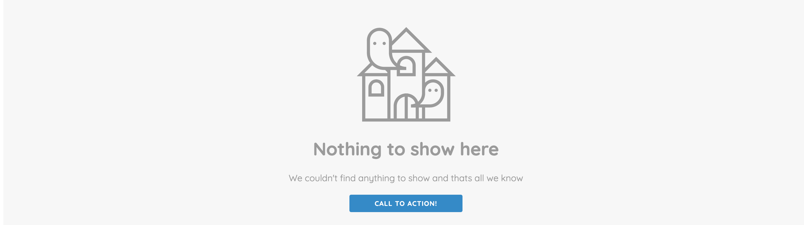

<br>

  

<h2  align="center">
	Empty State Component
</h2>

<p  align="center">


</p>

  

<br>

  
  

## Intro

- Vue Empty state component

 
  

## Screenshots

  

<p  align="center">



</p>

  

<br>

  

## Install and Usage

  

```bash

# clone empty state component

git clone https://github.com/pharzan/chatchamp-empty-state chatchamp-empty-state

  

# install dependices

yarn

  

# to run the demo

yarn demo

  

# to run the component

yarn dev

  

# to run the tests

yarn test

 ````
  

To use the component anywhere in your project, place the source code somewhere in your components folder in your project and use it as a component in the App.vue file.

  

````js
import EmptyStateComponent from '../src'
Vue.component('EmptyStateComponent', EmptyStateComponent)
````

Now you can use the tag anywhere in your project and pass in the parameters to control the component

`````js
<empty-state-component :data="data" v-on:click="counter++"/>
`````

  

## API

  

<details><summary><strong>Component parameters:</strong></summary>

<br>

  

1. **`value`**: Number

  

2. **`on-when`**: Function

**params**: func ( ...param )

hook function  when ...

  

<br/>

</details>

  

<details><summary><strong>Much more APIs</strong></summary>

<br>

  

1. **`more`**: Boolean

**default**: `false`

...

  

<br/>

</details>

  

<details><summary><strong>Categorize them</strong></summary>

<br>

  

1. **`categorize`**: Object

...

  

<br/>

</details>

  

<br>

  

## Other things such as Contribute guide / License / Thanks ...

  

> It's your turn